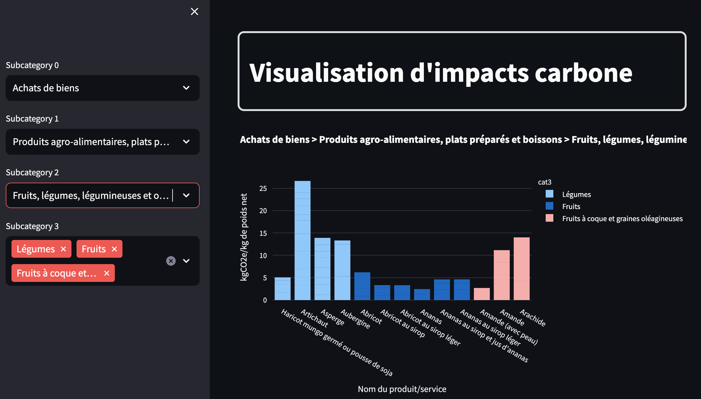

# Streamlit climate web app

**Simple Web App using Streamlit and using ADEME API in order to display relevant carbon emission impact of products and services surronding us.**

### Getting started

#### Online use

You can access the deployed version of the application here :

<!-- <div style="display: flex; justify-content: center;">
<a href="https://app-climate-webapp-ldfkuqprvtzxldy6qnzf65.streamlit.app/" style="display: inline-block; padding: 10px 20px; background-color: #007BFF; color: white; text-decoration: none; border-radius: 5px; ">Visit app</a>
</div> -->


<a href="https://app-climate-webapp-ldfkuqprvtzxldy6qnzf65.streamlit.app/" style="display: inline-block; padding: 1rem; background-color: #007BFF; color: white; text-decoration: none; border-radius: 5px;">Visit app</a>


or at the following url: https://app-climate-webapp-ldfkuqprvtzxldy6qnzf65.streamlit.app/

#### Local use

In order to use the web application locally, you must:
- clone the repository
- install the required dependencies running the command ```pip install -r requirements.txt```.
- run the command ```streamlit run Home.py``` to run the application.

Enjoy :) 

### Data sources

Data comes from one ADEME Dataset about carbon emissions.

API url: https://data.ademe.fr/datasets/base-carboner

### Preview

<br>
<p align="center">

</p>
<!--  -->

### Contact me

**Linkedin:** https://www.linkedin.com/in/jonas-william/

<!-- Ressources : https://www.youtube.com/watch?v=gr_KyGfO_eU&list=PLtqF5YXg7GLmCvTswG32NqQypOuYkPRUE&index=36 -->